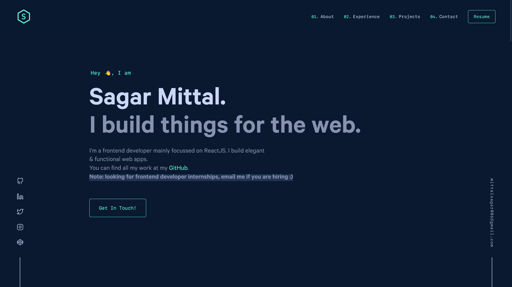

# Personal Portfolio Website

This is the 4th version of my personal portfolio. I want to use Gatsby & the template of Brittany Chiang's [v4](https://github.com/bchiang7/v4).

It has all the sections that I wanted & the overall look is superb.

## 🛠 Installation & Set Up

1. Install the Gatsby CLI

   ```bash
   npm install -g gatsby-cli
   ```

2. Install dependencies

   ```sh
   yarn
   ```

3. Start the development server

   ```bash
   gatsby develop
   ```

> **Note** if you facing problem of starting dev server then delete `yarn.lock` file & run `yarn install` again.

> **Warning** Make your own `env.production` file & add your Google Analytics `GA_ID` to use it.

## Demo



## 🎨 Color Reference

| Color          | Hex                                                                |
| -------------- | ------------------------------------------------------------------ |
| Navy           |  `#0a192f` |
| Light Navy     |  `#112240` |
| Lightest Navy  |  `#233554` |
| Slate          |  `#8892b0` |
| Light Slate    |  `#a8b2d1` |
| Lightest Slate |  `#ccd6f6` |
| White          |  `#e6f1ff` |
| Green          |  `#64ffda` |
